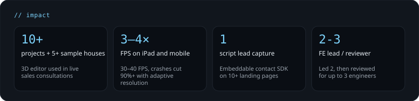
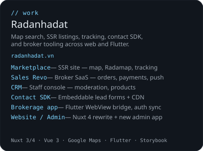
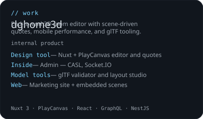
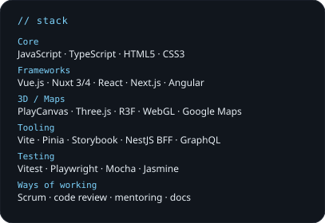
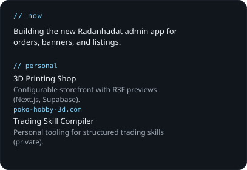

<!--
  AnhQuocIT profile README — dark bento dashboard.
  Edit profile.yml then run: npm run build
-->

  

  

  
  &nbsp;
  

  
  &nbsp;
  

<!-- Metrics appear after METRICS_TOKEN is set and the Metrics workflow runs -->

  

  <a href="https://linkedin.com/in/anhquocit">LinkedIn</a>
  ·
  <a href="mailto:quocnguyenn0206@gmail.com">Email</a>
  ·
  <a href="https://radanhadat.vn">radanhadat.vn</a>
  ·
  <a href="https://github.com/AnhQuocIT">GitHub</a>

Plain-text profile (screen readers / quick scan)

**Nguyen Anh Quoc** — Senior Frontend Developer (7+ yrs), Ho Chi Minh City.

Frontend architecture, performance, and production WebGL/3D — from SSR platforms to tablet-ready editors.

**Impact**
- 10+ projects and 5+ sample houses: 3D editor used in live sales consultations
- iPad and mobile: editor went from crash/stutter to stable use
- Contact SDK: embeddable lead capture on 10+ landing pages with one script
- Led a frontend team of 2, then primary reviewer for up to 3 engineers

**Selected work**
- **Radanhadat** ([radanhadat.vn](https://radanhadat.vn)) — Marketplace, Sales Revo, CRM, Contact SDK, Flutter brokerage bridge, Nuxt 4 site + admin
- **dghome3d** — Design tool (Nuxt + PlayCanvas), Inside admin, glTF model tools, marketing web
- **3D Printing Shop** ([poko-hobby-3d.com](https://poko-hobby-3d.com)) — Next.js storefront with R3F previews
- **Trading Skill Compiler** — personal tooling (private)

**Stack:** TypeScript, Vue/Nuxt, React/Next, PlayCanvas/Three.js, Storybook, Vitest/Playwright, Flutter (bridge work)

